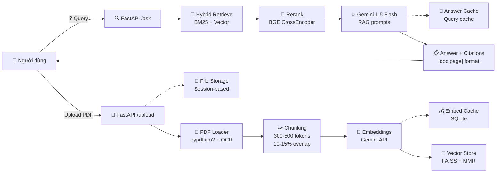
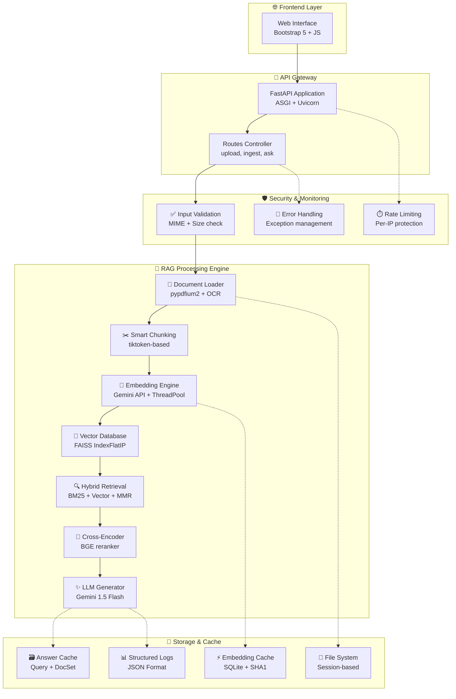

# 📚 RAG PDF QA System

> **Hệ thống hỏi đáp tài liệu PDF thông minh** sử dụng kiến trúc **RAG (Retrieval-Augmented Generation)** với **FastAPI + Google Gemini AI + FAISS**. Ứng dụng web hiện đại cho phép tải lên tài liệu PDF và đặt câu hỏi bằng tiếng Việt, nhận câu trả lời chính xác kèm trích dẫn nguồn chi tiết.

---


## 🌟 Giới thiệu tổng quan

RAG PDF QA System là một ứng dụng web được xây dựng để giải quyết bài toán hỏi đáp trên tài liệu PDF một cách thông minh và hiệu quả. Hệ thống kết hợp công nghệ AI tiên tiến với giao diện người dùng trực quan, cho phép:

- **Tương tác tự nhiên** với tài liệu PDF bằng ngôn ngữ tự nhiên
- **Trích xuất thông tin chính xác** với trích dẫn nguồn rõ ràng
- **Xử lý đa tài liệu** với khả năng quản lý session riêng biệt
- **Tối ưu hiệu năng** với hệ thống cache thông minh
- **Hỗ trợ OCR** cho các tài liệu scan/ảnh

Hệ thống đặc biệt phù hợp cho việc học tập, nghiên cứu, và xử lý tài liệu trong môi trường doanh nghiệp.

---

## 🏗️ Kiến trúc & Công nghệ chính

### Luồng xử lý RAG chi tiết



### Kiến trúc tổng thể hệ thống



### Công nghệ sử dụng

#### 🚀 Backend Framework
- **FastAPI**: High-performance async web framework với auto-documentation
- **Uvicorn**: ASGI server với khả năng scale cao và hot-reload
- **Pydantic**: Data validation, serialization và type safety

#### 🤖 AI & Machine Learning Stack
- **Google Gemini API**: 
  - `text-embedding-004` (768 dimensions) cho vector embeddings
  - `gemini-1.5-flash` cho text generation với context window lớn
- **FAISS**: Facebook AI Similarity Search - vector database tối ưu cho cosine similarity
- **BGE Reranker**: BAAI/bge-reranker-base cross-encoder cho re-ranking precision
- **BM25**: Sparse retrieval algorithm cho keyword matching
- **MMR**: Maximal Marginal Relevance cho đa dạng hóa kết quả

#### 📄 Document Processing Pipeline
- **pypdfium2**: PDF text extraction với performance cao
- **pymupdf**: Fallback PDF processor cho các trường hợp đặc biệt
- **Tesseract OCR**: Optical Character Recognition cho PDF scan/ảnh
- **tiktoken**: OpenAI tokenizer cho chunking chính xác theo tokens

#### 🎨 Frontend Technology
- **Bootstrap 5**: Responsive UI framework với dark/light theme
- **Vanilla JavaScript**: Lightweight client-side logic, không dependencies
- **Jinja2**: Server-side templating engine cho FastAPI

#### 💾 Storage & Performance
- **SQLite**: Local database cho embedding và answer cache
- **File System**: Session-based file management với security validation
- **Multi-threading**: Concurrent embedding generation với ThreadPool
- **Đường dẫn linh hoạt**: FAISS index và manifest đồng bộ với cấu hình `UPLOAD_DIR` trong `.env`.

---

## ✨ Tính năng nổi bật

### 📤 Quản lý tài liệu PDF thông minh
- **Upload đa file**: Hỗ trợ tải lên đến **5 file PDF** cùng lúc (≤ **10MB/file**)
- **Validation nghiêm ngặt**: Kiểm tra MIME type `application/pdf` và chữ ký PDF `%PDF`
- **OCR tích hợp**: Xử lý tài liệu scan/ảnh với **Tesseract OCR** (vie+eng)
- **Text chunking thông minh**: Token-aware splitting (**300-500 tokens**, overlap **10-15%**)
- **Noise removal**: Tự động phát hiện và loại bỏ header/footer lặp lại
- **Session isolation**: Mỗi đoạn chat có workspace riêng biệt

- **Session normalization & validation**: `session_id` được chuẩn hóa và kiểm tra để ngăn path traversal và các giá trị không hợp lệ, giúp an toàn hơn khi lưu file theo session.
- **Chịu lỗi từng file**: Nếu một PDF vi phạm giới hạn hoặc sai định dạng, các file hợp lệ vẫn được lưu và hiển thị thông báo chi tiết.
- **Xoá tài liệu an toàn**: Cho phép gỡ từng PDF khỏi session; manifest và vector store được thiết lập lại để tránh sót dữ liệu cũ.

### 🔍 Hệ thống tìm kiếm lai (Hybrid Search)
- **Dense Retrieval**: Vector search với cosine similarity trên Gemini embeddings
- **Sparse Retrieval**: BM25 algorithm cho keyword matching chính xác
- **Hybrid Fusion**: Kết hợp BM25 + Vector với trọng số **alpha=0.5** có thể điều chỉnh
- **MMR Diversification**: Maximal Marginal Relevance (λ=0.5) để đa dạng hóa kết quả
- **Cross-Encoder Reranking**: BGE reranker-base để cải thiện độ chính xác top-K
- **Configurable Parameters**: 
  - `RETRIEVE_TOP_K=12` candidates
  - `CONTEXT_K=6` final contexts
  - `MMR_LAMBDA=0.5` diversity factor

### 🧠 Sinh câu trả lời thông minh
- **Context-aware Generation**: Sử dụng **Gemini 1.5 Flash** với prompt engineering
- **Mandatory Citations**: Bắt buộc format **[doc:page]** cho mọi thông tin trích dẫn
- **Guardrail System**: `GENERATE_MIN_SIM=0.20` để tránh hallucination
- **Vietnamese Optimization**: Prompt được tối ưu cho tiếng Việt
- **Confidence Scoring**: Tính toán độ tin cậy dựa trên vector similarity
- **Temperature Control**: `temperature=0.1` cho output ổn định
- **Thông báo lỗi rõ ràng**: Giám sát phản hồi Gemini để phát hiện prompt bị chặn/quá quota và phản hồi thân thiện cho người dùng.
- **Robust generation parsing**: Hệ thống đã cải tiến để xử lý các response bất thường từ Gemini (fallback sang `candidates` khi `text` không khả dụng). Thay vì crash, API trả về thông báo thân thiện và ghi log chi tiết để debug.

### 💬 Quản lý hội thoại đa phiên
- **Mỗi chat = một session độc lập**: Khi tạo cuộc trò chuyện mới, hệ thống phát sinh session riêng, cô lập hoàn toàn lịch sử hội thoại và tài liệu.
- **Bảng điều khiển trực quan**: Thanh bên trái hiển thị mã session, số tài liệu đã xử lý và tổng số đoạn chat để bạn theo dõi trạng thái nhanh chóng.
- **Chuyển đổi tức thì**: Click để mở lại bất kỳ cuộc trò chuyện nào, mọi tin nhắn và trích dẫn được tải về ngay lập tức.
- **Đổi tên linh hoạt**: Đặt lại tiêu đề chat chỉ bằng một cú nhấp chuột, giúp ghi nhớ nội dung làm việc.
- **Xoá gọn gàng**: Loại bỏ những đoạn chat đã hoàn thành; session và vector store tương ứng được dọn sạch khỏi ổ đĩa.
- **Khôi phục tự động**: Lưu session gần nhất vào LocalStorage; khi mở lại ứng dụng, cuộc trò chuyện cuối cùng được kích hoạt sẵn.

### ⚡ Tối ưu hiệu năng & Cache
- **Multi-layer Caching**: 
  - **Embedding Cache**: SHA1-based trong SQLite (giảm 90% API calls)
  - **Answer Cache**: Query + DocumentSet hashing cho instant responses
- **Concurrent Processing**: ThreadPool với `EMBED_CONCURRENCY=4` cho batch embedding
- **Session Management**: Cách ly dữ liệu theo `session_id` UUID
- **Rate Limiting**: Bảo vệ API endpoints:
  - `/upload`: 5 requests/minute
  - `/ingest`: 3 requests/5 minutes  
  - `/ask`: 30 requests/minute

### 🛡️ Bảo mật & Monitoring Production-Ready
- **Input Validation**: 
  - File size limits và MIME type checking
  - PDF signature validation (`%PDF` header)
  - Filename sanitization với regex pattern
- **Security Headers**: CORS configuration và security middleware
- **Structured Logging**: JSON format logs trong `./logs/` với rotation
- **Error Handling**: Comprehensive exception handling với user-friendly messages
- **Health Monitoring**: `/healthz` endpoint cho load balancer checks
- **Memory Management**: Streaming file upload để tránh memory overflow

---

## 🔧 Cài đặt & Thiết lập

### Yêu cầu hệ thống

#### Môi trường tối thiểu
- **Python**: 3.10 - 3.12
- **RAM**: ≥ 4GB (khuyến nghị 8GB)
- **Storage**: ≥ 2GB trống
- **OS**: Windows 10+, macOS 11+, Ubuntu 20.04+

#### Dependencies chính
- **Google Gemini API Key**: Từ [Google AI Studio](https://aistudio.google.com/)
- **Tesseract OCR** (tuỳ chọn): Cho xử lý PDF scan

### Hướng dẫn cài đặt chi tiết

#### Bước 1: Clone và setup môi trường
```bash
# Clone repository
git clone https://github.com/dungle03/rag-pdf.git
cd rag-pdf

# Tạo môi trường ảo
python -m venv .venv

# Kích hoạt môi trường ảo
# Windows PowerShell:
.\.venv\Scripts\Activate.ps1
# macOS/Linux:
source .venv/bin/activate

# Cài đặt dependencies
pip install -r requirements.txt
```

#### Bước 2: Cấu hình môi trường (.env)

Tạo file `.env` từ template:
```bash
cp .env.example .env
```

Chỉnh sửa file `.env` với cấu hình đầy đủ:
```ini
# === AI Models Configuration ===
GEMINI_API_KEY=your_actual_api_key_here
RAG_EMBED_MODEL=text-embedding-004
RAG_LLM_MODEL=gemini-1.5-flash
EMBED_DIM=768

# === Retrieval & Search Settings ===
HYBRID_ON=true                    # Bật hybrid search (BM25 + Vector)
HYBRID_ALPHA=0.5                  # Trọng số BM25 vs Vector (0.5 = cân bằng)
RETRIEVE_TOP_K=12                 # Số candidates ban đầu
CONTEXT_K=6                       # Số contexts cuối cùng cho LLM
MMR_LAMBDA=0.5                    # Diversity factor cho MMR

# === Reranking (Optional - tăng accuracy) ===
RERANK_ON=true                    # Bật BGE reranker (tăng latency ~500ms)

# === Generation Settings ===
GENERATE_MIN_SIM=0.20             # Threshold tối thiểu để sinh câu trả lời
ANSWER_MIN_CONTEXT_PROB=0.30      # Bỏ qua câu trả lời nếu ngữ cảnh quá yếu
ANSWER_MIN_DIRECT_PROB=0.20       # Từ chối nếu không đủ bằng chứng trực tiếp
GEN_TEMPERATURE=0.1               # Temperature cho generation (0.1 = ổn định)
GEN_MAX_OUTPUT_TOKENS=256         # Giới hạn độ dài output

# === Storage & Caching ===
VECTOR_STORE=faiss                # faiss hoặc chroma
PERSIST_DIR=./storage
ENABLE_EMBED_CACHE=true           # Cache embeddings (giảm 90% API calls)
EMBED_CACHE_DB=./storage/embed_cache.sqlite
ENABLE_ANSWER_CACHE=true          # Cache câu trả lời
ANSWER_CACHE_DB=./storage/answer_cache.sqlite

# === File Upload Constraints ===
MAX_FILES=5                       # Tối đa 5 files/lần
MAX_FILE_MB=10                    # Tối đa 10MB/file
UPLOAD_DIR=./uploads

# === OCR Configuration (Optional) ===
TESSERACT_CMD=C:\Program Files\Tesseract-OCR\tesseract.exe  # Windows
# TESSERACT_CMD=/usr/bin/tesseract  # Linux/macOS
OCR_LANG=vie+eng                  # Ngôn ngữ OCR (Vietnamese + English)

# === Performance Tuning ===
EMBED_CONCURRENCY=4               # Số threads cho embedding generation
EMBED_SLEEP_MS=100                # Delay giữa API calls (tránh rate limit)

# === Chunking Parameters ===
CHUNK_SIZE=380                    # Kích thước chunk (tokens)
CHUNK_OVERLAP=50                  # Overlap giữa chunks (tokens)
```

> **💡 Lưu ý quan trọng:**
> - **GEMINI_API_KEY**: Lấy từ [Google AI Studio](https://aistudio.google.com/) (miễn phí)
> - **HYBRID_ALPHA**: 0.5 = cân bằng, >0.5 = ưu tiên BM25, <0.5 = ưu tiên Vector
> - **RERANK_ON**: `true` tăng accuracy nhưng tăng latency, `false` để demo nhanh
> - **ANSWER_MIN_CONTEXT_PROB / ANSWER_MIN_DIRECT_PROB**: Điều chỉnh để kiểm soát mức độ tự tin tối thiểu trước khi trả lời; tăng giá trị nếu muốn chatbot thận trọng hơn.
> - **Cache**: Bật để tiết kiệm API quota khi test/demo nhiều lần

#### Bước 3: Cài đặt OCR (Tuỳ chọn)

**Windows:**
1. Tải [Tesseract OCR](https://github.com/UB-Mannheim/tesseract/wiki)
2. Cài đặt vào `C:\Program Files\Tesseract-OCR\`
3. Đường dẫn trong `.env` sẽ tự động khớp

**macOS:**
```bash
brew install tesseract
```

**Ubuntu/Debian:**
```bash
sudo apt-get install tesseract-ocr tesseract-ocr-vie
```

#### Bước 4: Cài đặt Reranker (Tuỳ chọn)

Để tăng độ chính xác (tăng thời gian xử lý):
```bash
# Cài đặt PyTorch (CPU version)
pip install torch --index-url https://download.pytorch.org/whl/cpu

# Sentence Transformers cho reranking
pip install sentence-transformers
```

---

## 🚀 Hướng dẫn sử dụng

### Khởi động hệ thống

```bash
# Development mode (auto-reload)
uvicorn app.main:app --reload --host 127.0.0.1 --port 8000

# Production mode
uvicorn app.main:app --host 127.0.0.1 --port 8000 --workers 4
```

Truy cập ứng dụng tại: `http://127.0.0.1:8000`

### Quy trình sử dụng cơ bản

#### 1. Upload tài liệu PDF
- Kéo thả hoặc chọn file PDF (tối đa 5 file, 10MB/file)
- Hệ thống tự động validate và hiển thị danh sách file
- File được lưu trong session riêng biệt

#### 2. Xử lý và Vector hóa (Ingest)
- Bật OCR nếu có tài liệu scan/ảnh
- Nhấn "Xử lý & Vector hóa"
- Hệ thống sẽ:
  - Trích xuất text từ PDF
  - Chia nhỏ thành chunks
  - Tạo embeddings
  - Lưu vào vector database

#### 3. Đặt câu hỏi
- Nhập câu hỏi bằng tiếng Việt
- Nhận câu trả lời kèm:
  - Nội dung trả lời chính xác
  - Trích dẫn nguồn [file:trang]
  - Độ tin cậy (confidence score)
  - Đoạn văn liên quan

### Ví dụ sử dụng

```bash
# Health check
curl http://127.0.0.1:8000/healthz

# Upload file qua API
curl -X POST "http://127.0.0.1:8000/upload" \
  -H "Content-Type: multipart/form-data" \
  -F "files=@document.pdf" \
  -F "session_id=test-session"

# Ingest documents
curl -X POST "http://127.0.0.1:8000/ingest" \
  -H "Content-Type: application/x-www-form-urlencoded" \
  -d "session_id=test-session&ocr=false"

# Ask question
curl -X POST "http://127.0.0.1:8000/ask" \
  -H "Content-Type: application/x-www-form-urlencoded" \
  -d "session_id=test-session&query=Nội dung chính của tài liệu là gì?"
```

### API Endpoints chi tiết

| Endpoint | Method | Mô tả | Request Format | Response Format |
|----------|--------|--------|----------------|-----------------|
| `/` | GET | Trang chủ web interface | - | HTML template |
| `/session` | POST | Tạo session/chat mới trống | **Form fields:**<br/>• `title`: string (optional) | ```json<br/>{ "session_id": "...", "chat": {"chat_id": "..."}, "session": {...} }``` |
| `/sessions` | GET | Liệt kê toàn bộ session hiện có | - | ```json<br/>{ "sessions": [{ "session_id": "...", "title": "...", "message_count": 0 }] }``` |
| `/upload` | POST | Upload PDF files | **Form fields:**<br/>• `files`: multipart array<br/>• `session_id`: UUID (optional) | ```json<br/>{ "session_id": "uuid", "files": [...], "errors": [{ "file": "bad.pdf", "error": "File vượt quá 10 MB" }] }``` |
| `/ingest` | POST | Xử lý và vector hóa tài liệu | **Form fields:**<br/>• `session_id`: UUID string<br/>• `ocr`: boolean (optional) | ```json<br/>{"ingested": [{"doc": "a.pdf", "pages": 10, "chunks": 35}], "total_chunks": 35, "latency_ms": 9123}``` |
| `/ingest/job/{job_id}` | GET | Lấy trạng thái job ingest chạy nền (nếu dùng param `background=true`) | - | ```json<br/>{"job_id":"job-...","status":"pending|done|failed","progress":0-100,"result":{...}}``` |
| `/ask` | POST | Đặt câu hỏi RAG | **Form fields:**<br/>• `query`: Vietnamese text<br/>• `session_id`: UUID<br/>• `selected_docs`: JSON array (optional) | ```json<br/>{"answer": "… [a.pdf:3] …", "confidence": 0.91, "sources": [...], "latency_ms": 1234}``` |
| `/session/{session_id}/rename` | POST | Đổi tên session/chat | **Form fields:**<br/>• `title`: string<br/>• `chat_id`: string (optional) | ```json<br/>{ "session": { "session_id": "...", "title": "..." } }``` |
| `/session/{session_id}` | DELETE | Xoá session cùng tài nguyên | - | ```json<br/>{ "deleted": true }``` |
| `/session/{session_id}/file/{doc_name}` | DELETE | Xoá một PDF đã tải lên khỏi session hiện tại | - | ```json<br/>{ "deleted": true, "doc": "file.pdf", "session": {...} }``` |
| `/docs` | GET | Liệt kê tài liệu đã xử lý | - | ```json<br/>{"sessions": [{"session_id": "...", "docs": [...]}]}``` |
| `/healthz` | GET | Health check endpoint | - | ```json<br/>{"status": "ok"}``` |

---

## 🧪 Testing & Evaluation

### Test nhanh toàn bộ workflow

```bash
# Kiểm tra server và workflow cơ bản
python tests/simple_test.py
```

Script sẽ thực hiện:
- Health check server
- Upload file test
- Ingest tài liệu
- Chạy các câu hỏi mẫu
- Báo cáo accuracy và latency

### Evaluation chi tiết

```bash
# Chạy evaluation với test cases từ JSON
python tests/run_eval.py

# Hoặc với session có sẵn
TEST_SESSION_ID=existing-session python tests/run_eval.py
```

### Customizing test cases

Chỉnh sửa `tests/eval_cases.json`:
```json
[
  {
    "q": "Câu hỏi của bạn?",
    "expected": ["từ khóa 1", "từ khóa 2", "từ khóa 3"]
  }
]
```

### Performance Monitoring

Xem logs chi tiết:
```bash
# Logs được lưu trong ./logs/
tail -f logs/rag_pdf_$(date +%Y%m%d).log
```

Metrics được theo dõi:
- Request count và error rate
- Response time average/min/max
- Cache hit rate
- Token usage

---

## 🔧 Đóng góp & Phát triển

### Cấu trúc dự án chi tiết

```
rag-pdf/
├── app/                           # 🚀 Core Application
│   ├── main.py                   # FastAPI app initialization + CORS + static mounting
│   ├── routes.py                 # API endpoints với error handling
│   ├── rag/                      # 🧠 RAG Engine - Toàn bộ logic AI
│   │   ├── pdf_loader.py         # PDF processing: pypdfium2 + OCR + header/footer removal
│   │   ├── chunking.py           # Token-aware text chunking với tiktoken
│   │   ├── embeddings.py         # Gemini embedding + SHA1 cache + ThreadPool
│   │   ├── vectorstore.py        # FAISS wrapper: IndexFlatIP + MMR + persistence
│   │   ├── hybrid.py             # BM25 + Vector fusion + diversity ranking
│   │   ├── rerank.py             # BGE cross-encoder reranking (optional)
│   │   ├── generator.py          # Gemini 1.5 Flash + citation-aware prompts
│   │   ├── answer_cache.py       # SQLite-based answer caching
│   │   └── cache.py              # Embedding cache utilities
│   └── utils/                    # 🛠️ Production Utilities
│       ├── config.py             # Environment variable parsing + validation
│       ├── logger.py             # Structured logging với JSON format
│       ├── security.py           # Input validation + file sanitization + MIME check
│       ├── monitoring.py         # Error handling + metrics collection
│       ├── rate_limiter.py       # Per-IP rate limiting cho API endpoints
│       ├── schema.py             # Pydantic models cho request/response
│       └── hash.py               # SHA1 hashing cho cache keys
├── static/                       # 🎨 Frontend Assets
│   ├── app.css                  # Responsive CSS: Bootstrap 5 + custom theming
│   └── app.js                   # Vanilla JS: file upload + chat interface + citations
├── templates/                    # 📄 HTML Templates
│   └── index.html               # Jinja2 template: 3-column layout + dark/light theme
├── tests/                        # 🧪 Test Suite
│   ├── eval_cases.json          # Test scenarios: questions + expected keywords
│   ├── simple_test.py           # End-to-end workflow test (upload→ingest→ask)
│   └── run_eval.py              # Detailed evaluation với accuracy metrics
├── storage/                      # 💾 Runtime Data (auto-created)
│   ├── embed_cache.sqlite       # Embedding cache database
│   ├── answer_cache.sqlite      # Answer cache database
│   └── faiss_index.bin          # FAISS vector index files
├── uploads/                      # 📁 Session-based File Storage
│   └── {session_id}/            # Isolated directories per user session
│       ├── document.pdf         # Uploaded PDF files
│       ├── manifest.json        # Session metadata + processing info
│       └── faiss_index.bin      # Session-specific FAISS index
├── logs/                         # 📊 Application Logs (auto-created)
│   └── rag_pdf_YYYYMMDD.log     # Daily log files với structured format
├── .venv/                        # 🐍 Python Virtual Environment
├── requirements.txt              # 📋 Python dependencies với version pinning
├── .env.example                  # 📝 Environment configuration template
├── .env                          # 🔒 Production environment variables (git-ignored)
├── .gitignore                    # 🚫 Git exclusions: .env, uploads/, storage/, logs/
└── README.md                     # 📖 This documentation
```

### 🔧 Thêm tính năng mới

#### Workflow Development
1. **Fork & Branch**
   ```bash
   git clone https://github.com/dungle03/rag-pdf.git
   cd rag-pdf
   git checkout -b feature/awesome-feature
   ```

2. **Setup Development Environment**
   ```bash
   python -m venv .venv
   source .venv/bin/activate  # Linux/Mac
   pip install -r requirements.txt
   pip install -e .  # Editable install
   ```

3. **Implement với Testing**
   ```bash
   # Tạo tests cho feature mới
   echo '{"q": "Test question?", "expected": ["keyword"]}' >> tests/eval_cases.json
   
   # Run tests
   python tests/simple_test.py
   python tests/run_eval.py
   ```

4. **Code Quality Checks**
   ```bash
   # Format code
   black app/ tests/
   
   # Type checking
   mypy app/
   
   # Linting
   flake8 app/ tests/
   ```

5. **Commit & Push**
   ```bash
   git add .
   git commit -m "feat: add awesome feature with tests"
   git push origin feature/awesome-feature
   ```

#### 📝 Code Style Guidelines
- **Type Hints**: Bắt buộc cho tất cả functions và class methods
- **Docstrings**: Google style cho modules, classes và public functions
- **Error Handling**: Sử dụng custom exceptions và structured error responses
- **Logging**: Structured logging với contextual information
- **Testing**: Unit tests + integration tests cho mọi feature mới

#### 🧪 Testing Strategy
```bash
# Unit tests cho individual components
python -m pytest tests/unit/ -v

# Integration tests cho entire workflow  
python -m pytest tests/integration/ -v

# Performance benchmarks
python tests/benchmark.py

# Load testing với multiple sessions
python tests/load_test.py --sessions 10 --queries 100
```

### Roadmap tính năng

#### Ngắn hạn
- [ ] Hỗ trợ nhiều định dạng file (DOCX, TXT, RTF)
- [ ] Cải thiện UI/UX với React frontend
- [ ] Export kết quả ra PDF/Word
- [ ] Multi-language support

#### Dài hạn
- [ ] Vector database scaling (Qdrant, Weaviate)
- [ ] Fine-tuned embeddings cho tiếng Việt
- [ ] Multi-modal support (images, tables)
- [ ] Collaborative features (sharing, comments)

---

## 📄 Giấy phép & Thông tin tác giả

### Thông tin dự án

- **Tên dự án**: RAG PDF QA System
- **Sinh viên**: Lê Đình Dũng
- **MSSV**: 211240089
- **Email**: [ledinhdung2908@gmail.com](mailto:ledinhdung2908@gmail.com)
- **GitHub**: [@dungle03](https://github.com/dungle03)

### Thông tin học tập

- **Môn học**: Chuyên đề Công nghệ Thông tin - Bài tập lớn
- **Năm học**: 2024-2025
- **Giảng viên hướng dẫn**: Thầy Bùi Ngọc Dũng

### Giấy phép sử dụng

Dự án được phát triển cho mục đích **học tập và nghiên cứu**. 

#### Điều khoản sử dụng:
- ✅ Sử dụng cho mục đích học tập
- ✅ Tham khảo và học hỏi
- ✅ Đóng góp cải thiện
- ⚠️ **Trích dẫn nguồn** khi sử dụng
- ❌ Sử dụng thương mại mà không có sự đồng ý

#### Trích dẫn:
```
Lê Đình Dũng (2024). RAG PDF QA System - Hệ thống hỏi đáp tài liệu PDF thông minh. 
Bài tập lớn môn Chuyên đề CNTT. 
GitHub: https://github.com/dungle03/rag-pdf
```

### Acknowledgments

Cảm ơn các công nghệ và thư viện mã nguồn mở:
- FastAPI team for the excellent web framework
- Google for Gemini AI APIs
- Facebook AI Research for FAISS
- Tesseract OCR community
- All contributors to the Python ecosystem

---

## 🆘 Hỗ trợ & Troubleshooting

### Các lỗi thường gặp và cách khắc phục

#### 1. 🔑 Lỗi API Key
```bash
# Lỗi: "API key not valid" hoặc 400 Bad Request
# Nguyên nhân: GEMINI_API_KEY không đúng hoặc chưa set

# Kiểm tra API key:
export GEMINI_API_KEY="your-actual-key"

# Test API key bằng Python:
python -c "
import google.generativeai as genai, os
genai.configure(api_key=os.getenv('GEMINI_API_KEY'))
result = genai.embed_content(model='text-embedding-004', content='test')
print(f'✅ API Key valid! Dimension: {len(result[\"embedding\"])}')
"

# ⚠️ Quan trọng: Restart server sau khi đổi .env
uvicorn app.main:app --reload
```

#### 2. 🖼️ Lỗi Tesseract OCR
```bash
# Lỗi: "tesseract is not installed or it's not in your PATH"

# Windows - Cài đặt Tesseract:
# 1. Tải từ: https://github.com/UB-Mannheim/tesseract/wiki
# 2. Cài vào: C:\Program Files\Tesseract-OCR\
# 3. Cập nhật .env: TESSERACT_CMD=C:\Program Files\Tesseract-OCR\tesseract.exe

# macOS:
brew install tesseract

# Ubuntu/Debian:
sudo apt-get update
sudo apt-get install tesseract-ocr tesseract-ocr-vie

# ⚠️ Nếu không cần OCR: Bỏ tick "Sử dụng OCR" trong UI
```

#### 3. 💾 Lỗi FAISS Installation
```bash
# Lỗi: Cannot install faiss-cpu (thường trên Windows)

# Giải pháp 1: Reinstall với cache clear
pip uninstall faiss-cpu
pip install faiss-cpu --no-cache-dir --force-reinstall

# Giải pháp 2: Chuyển sang ChromaDB
# Trong .env: VECTOR_STORE=chroma
pip install chromadb

# Giải pháp 3: Conda environment
conda install -c conda-forge faiss-cpu
```

#### 4. 🧠 Lỗi Memory/Performance
```bash
# Lỗi: Out of memory hoặc quá chậm

# Giảm batch size embedding:
export EMBED_CONCURRENCY=2

# Giảm context window:
export CONTEXT_K=4
export RETRIEVE_TOP_K=8

# Tắt reranker để tiết kiệm memory:
export RERANK_ON=false

# Giảm chunk size:
export CHUNK_SIZE=300
export CHUNK_OVERLAP=30
```

#### 5. 🚫 Lỗi Vector Store
```bash
# Lỗi: "Vector store chưa khởi tạo" hoặc "Index empty"

# Nguyên nhân: Chưa chạy /ingest trước /ask
# Giải pháp:
# 1. Upload files qua /upload
# 2. Chạy /ingest để tạo embeddings
# 3. Sau đó mới /ask

# Clear storage nếu bị corrupt:
rm -rf storage/
rm -rf uploads/
```

#### 6. 🐛 Lỗi Dependencies
```bash
# Lỗi: ModuleNotFoundError cho các thư viện

# Cài đầy đủ dependencies:
pip install -r requirements.txt

# Nếu bị conflict, tạo environment mới:
python -m venv .venv-new
source .venv-new/bin/activate  # Linux/Mac
.\.venv-new\Scripts\Activate.ps1  # Windows
pip install -r requirements.txt

# Cài PyTorch cho reranker (optional):
pip install torch --index-url https://download.pytorch.org/whl/cpu
```

### 🎯 Tối ưu hiệu năng Production

#### Tăng độ chính xác (Accuracy)
```ini
# Trong .env:
HYBRID_ON=true                    # Bật hybrid search
HYBRID_ALPHA=0.5                  # Cân bằng keyword + semantic
RERANK_ON=true                    # Bật reranker (tăng latency)
CONTEXT_K=6                       # Đủ context cho LLM
MMR_LAMBDA=0.5                    # Đa dạng ngữ cảnh
GENERATE_MIN_SIM=0.25             # Threshold cao hơn để tránh hallucination
```

#### Tăng tốc độ (Speed)
```ini
# Trong .env:
RERANK_ON=false                   # Tắt reranker
EMBED_CONCURRENCY=8               # Tăng parallel embedding
CONTEXT_K=4                       # Giảm context
RETRIEVE_TOP_K=8                  # Giảm candidates
ENABLE_EMBED_CACHE=true           # Bật cache
ENABLE_ANSWER_CACHE=true          # Bật answer cache
```

#### Tiết kiệm API quota
```ini
# Trong .env:
ENABLE_EMBED_CACHE=true           # Cache embeddings (quan trọng!)
ENABLE_ANSWER_CACHE=true          # Cache answers
EMBED_SLEEP_MS=200                # Delay để tránh rate limit
CHUNK_SIZE=400                    # Chunk lớn hơn = ít API calls
```

### Liên hệ hỗ trợ

- **Issues**: [GitHub Issues](https://github.com/dungle03/rag-pdf/issues)
- **Email**: ledinhdung2908@gmail.com
