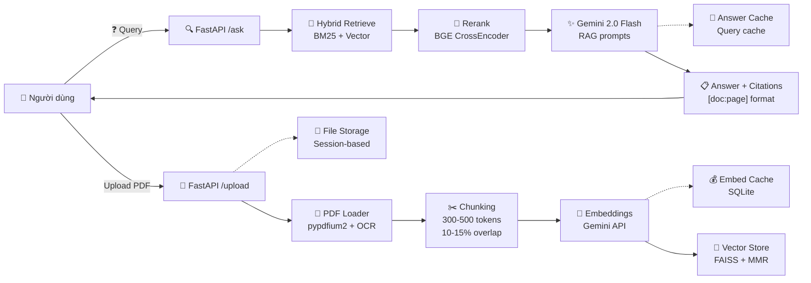
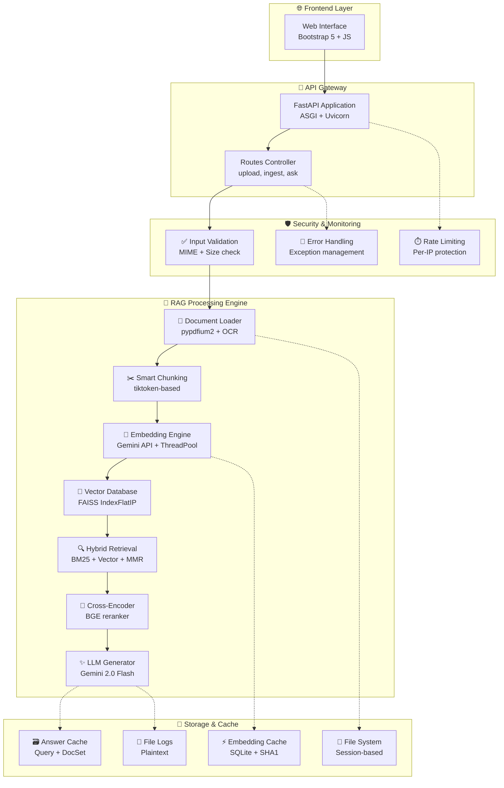

# 🏗️ Kiến trúc & Công nghệ

Phần này mô tả chi tiết về kiến trúc hệ thống, luồng xử lý RAG, và các công nghệ được sử dụng.

## Luồng xử lý RAG chi tiết

## Kiến trúc tổng thể hệ thống

## Công nghệ sử dụng

#### 🚀 Backend Framework
- **FastAPI**: High-performance async web framework.
- **Uvicorn**: ASGI server.
- **Pydantic**: Data validation.

#### 🤖 AI & Machine Learning Stack
- **Google Gemini API**: `text-embedding-004` & `gemini-2.0-flash-001`.
- **FAISS**: Vector database for similarity search.
- **BGE Reranker**: Cross-encoder for re-ranking.
- **BM25**: Sparse retrieval algorithm.
- **MMR**: Maximal Marginal Relevance for diversity.

#### 📄 Document Processing Pipeline
- **pypdfium2** & **pymupdf**: PDF text extraction.
- **Tesseract OCR**: Optical Character Recognition.
- **tiktoken**: Tokenizer for accurate chunking.

#### 🎨 Frontend Technology
- **Bootstrap 5**: Responsive UI framework.
- **Vanilla JavaScript**: Client-side logic.
- **Jinja2**: Server-side templating.

#### 💾 Storage & Performance
- **SQLite**: For embedding and answer cache.
- **File System**: Session-based file management.
- **Multi-threading**: Concurrent embedding generation.
