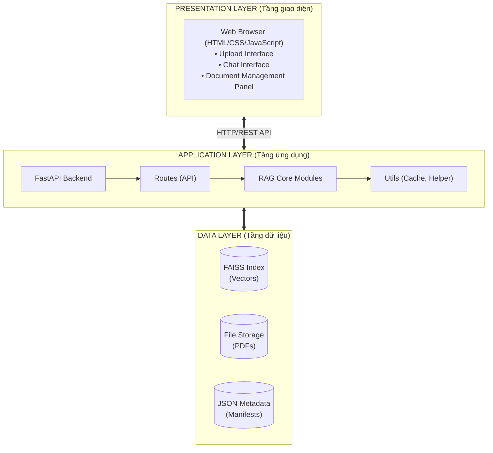
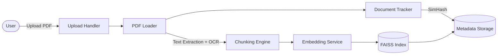
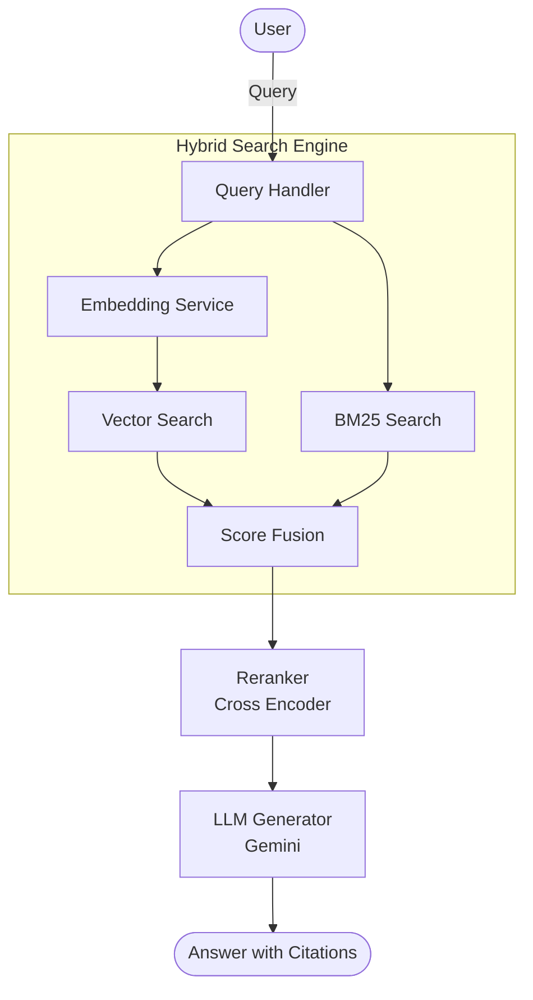
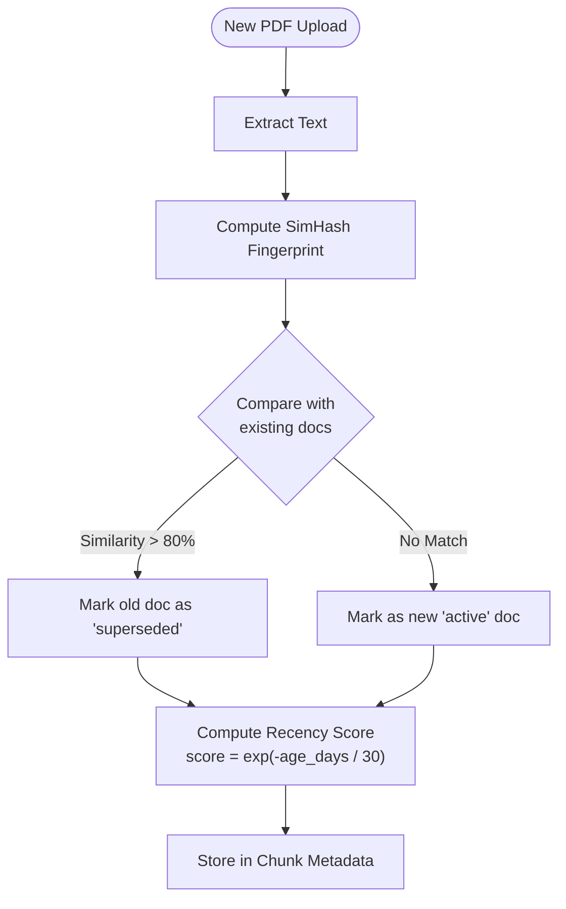

# 2.2. Kiến trúc hệ thống

## 2.2.1. Kiến trúc tổng thể

Hệ thống được thiết kế theo mô hình **3-tier architecture** (kiến trúc 3 tầng) để đảm bảo separation of concerns và dễ dàng maintain:



[Hình 2.1: Kiến trúc 3 tầng của hệ thống RAG-PDF]

## 2.2.2. Các components chính

Hệ thống bao gồm các module chính sau:

1.  **PDF Loader Module** (`pdf_loader.py`)
    *   Đọc và trích xuất text từ PDF.
    *   Fallback sang OCR cho PDF scan.
    *   Output: Text theo từng trang với metadata.

2.  **Chunking Engine** (`chunking.py`)
    *   Chia văn bản thành chunks 400 tokens (default).
    *   Áp dụng overlapping 50 tokens.
    *   Gắn metadata cho mỗi chunk.

3.  **Embedding Service** (`embeddings.py`)
    *   Load model Google Gemini `text-embedding-004`.
    *   Chuyển text → vector 768 chiều.
    *   Cache embeddings để tái sử dụng.

4.  **Vector Store Manager** (`vectorstore.py`)
    *   Quản lý FAISS index.
    *   Thêm, tìm kiếm, xóa vectors.
    *   Sync metadata với index.

5.  **Hybrid Search Engine** (`hybrid.py`)
    *   Vector search với FAISS.
    *   BM25 search với rank-bm25.
    *   Score fusion và ranking.

6.  **Reranker** (`rerank.py`)
    *   Cross-Encoder scoring.
    *   Top-k selection.

7.  **LLM Generator** (`generator.py`)
    *   Prompt engineering.
    *   Gemini API integration.
    *   Citation extraction.

8.  **Document Tracker** (`document_tracker.py`)
    *   SimHash fingerprinting.
    *   Duplicate detection.
    *   Version management.

9.  **Chat Manager** (`chat_manager.py`)
    *   Session management.
    *   Chat history storage.

10. **Caching System** (`cache.py`, `answer_cache.py`)
    *   Embedding cache.
    *   Answer cache.
    *   LRU eviction policy.

## 2.2.3. Data Flow - Luồng xử lý dữ liệu

### Ingestion Pipeline (Nạp tài liệu)



[Hình 2.2: Ingestion Pipeline - Quy trình nạp tài liệu]

### Query Pipeline (Xử lý câu hỏi)



[Hình 2.3: Query Pipeline - Quy trình xử lý câu hỏi]

### Recency Boost Flow (Ưu tiên tài liệu mới)



[Hình 2.4: Recency Boost Flow - Luồng ưu tiên tài liệu mới]

# 2.3. Thiết kế dữ liệu

## 2.3.1. Chunk Schema

Mỗi chunk (đoạn văn bản) được lưu trữ với cấu trúc sau:

```python
class Chunk:
    chunk_id: int           # ID (sequential integer per doc)
    text: str              # Nội dung văn bản của chunk
    doc_name: str          # Tên file gốc (VD: "policy.pdf")
    page: int              # Số trang trong PDF (bắt đầu từ 1)
    chunk_index: int       # Thứ tự chunk trong document
    upload_timestamp: float # Unix timestamp khi upload
    document_status: str   # "active", "superseded", "archived"
    document_version: int  # Version number (1, 2, 3...)
    recency_score: float   # Điểm ưu tiên (0.0-1.0)
    embedding: List[float] # Vector 768 chiều (không lưu trong JSON)
```

**Ví dụ:**

```json
{
  "chunk_id": "abc123",
  "text": "Nhân viên chính thức được hưởng 12 ngày phép năm...",
  "document_name": "employee_handbook.pdf",
  "page_number": 15,
  "chunk_index": 42,
  "upload_timestamp": 1702123456.78,
  "document_status": "active",
  "document_version": 2,
  "recency_score": 0.95
}
```

## 2.3.2. Document Metadata

Metadata của mỗi document được lưu trong file JSON:

```python
class DocumentMetadata:
    filename: str              # Tên file gốc
    upload_time: datetime      # Thời gian upload
    num_pages: int            # Số trang trong PDF
    num_chunks: int           # Số chunks được tạo ra
    fingerprint: str          # SimHash (64-bit binary string)
    status: str               # "active", "superseded", "archived"
    version: int              # Số version
    file_size_bytes: int      # Kích thước file
    ocr_applied: bool         # Có dùng OCR không
    superseded_by: str        # Filename của version mới (nếu có)
```

**File lưu trữ:** `uploads/{session_id}/document_fingerprints.json`

**Ví dụ:**

```json
{
  "policy_2023.pdf": {
    "filename": "policy_2023.pdf",
    "upload_time": "2024-01-15T10:30:00",
    "num_pages": 50,
    "num_chunks": 123,
    "fingerprint": "1010110101...",
    "status": "superseded",
    "version": 1,
    "superseded_by": "policy_2024.pdf"
  },
  "policy_2024.pdf": {
    "filename": "policy_2024.pdf",
    "upload_time": "2024-12-01T14:20:00",
    "num_pages": 55,
    "num_chunks": 135,
    "fingerprint": "1010110111...",
    "status": "active",
    "version": 2
  }
}
```

## 2.3.3. Session Data

Mỗi session được quản lý với cấu trúc:

```python
class Session:
    session_id: str              # UUID của session
    created_at: datetime         # Thời gian tạo
    last_accessed: datetime      # Lần truy cập cuối
    documents: List[str]         # Danh sách filenames
    total_chunks: int            # Tổng số chunks trong session
    chat_history: List[ChatMessage]  # Lịch sử hội thoại

class ChatMessage:
    role: str                    # "user" hoặc "assistant"
    content: str                 # Nội dung message
    timestamp: datetime          # Thời gian
    sources: List[Source]        # Citations (chỉ cho assistant)
```

**File lưu trữ:** `uploads/{session_id}/session_manifest.json`

## 2.3.4. Query Response Schema

Cấu trúc response trả về cho user:

```python
class QueryResponse:
    answer: str                  # Câu trả lời từ LLM
    sources: List[Source]        # Danh sách nguồn trích dẫn
    confidence: float            # Độ tin cậy (0.0-1.0)
    latency_ms: int              # Thời gian xử lý (milliseconds)
    cached: bool                 # Có dùng cache không

class Source:
    document_name: str           # Tên file
    page_number: int             # Số trang
    chunk_text: str              # Đoạn text gốc
    relevance_score: float       # Điểm liên quan
    document_status: str         # Status badge
    age_days: int                # Tuổi document (số ngày)
```

**Ví dụ response:**

```json
{
  "answer": "Nhân viên chính thức được hưởng 12 ngày phép năm [policy_2024.pdf:15]",
  "sources": [
    {
      "document_name": "policy_2024.pdf",
      "page_number": 15,
      "chunk_text": "Nhân viên chính thức được hưởng 12 ngày phép năm...",
      "relevance_score": 0.92,
      "document_status": "active",
      "age_days": 6
    }
  ],
  "confidence": 0.89,
  "latency_ms": 2150,
  "cached": false
}
```

## 2.3.5. Vector Database Structure

**FAISS Index:**

*   **Index Type:** `faiss.IndexFlatIP` (Inner Product).
*   **Dimension:** 768 (tương ứng với model `text-embedding-004`)
*   **Distance Metric:** Dot product (tương đương Cosine Similarity do vectors đã được L2-normalized)

**Storage:**

```text
uploads/{session_id}/
├── faiss_index.bin          # FAISS index file
├── items.jsonl              # Metadata & content của tất cả chunks (JSON Lines)
├── document_fingerprints.json
├── session_manifest.json
├── chat_history.json
└── pdfs/                    # Folder chứa PDF gốc
    ├── doc1.pdf
    └── doc2.pdf
```

**Sync mechanism:** FAISS index và metadata được đồng bộ qua parallel arrays:
*   `faiss_index` lưu vectors tại index `i`
*   `chunk_metadata[i]` lưu metadata tương ứng

## 2.3.6. Cache Structure

**Embedding Cache (`app/rag/cache.py`):**

*   **Type:** Persistent Cache.
*   **Backend:** SQLite Database (`embed_cache.sqlite`).
*   **Schema:** `(k TEXT PRIMARY KEY, dim INTEGER, vec BLOB)`
*   **Mechanism:** Hash(text) -> Embedding Vector (768 dim).

**Answer Cache (`app/rag/answer_cache.py`):**

*   **Type:** Persistent Cache.
*   **Backend:** SQLite Database (`answer_cache.sqlite`).
*   **TTL:** Không giới hạn cứng (có thể clear bằng cách xóa file DB).
*   **Schema:** `(k TEXT, answer TEXT, confidence REAL, citations TEXT, ts INTEGER)`
*   **Key Generation:** `k = question + sorted(available_docs)`

**Storage Locations:**

*   `storage/embed_cache.sqlite` (Global cache cho embeddings)
*   `storage/answer_cache.sqlite` (Global cache cho QA pairs)
