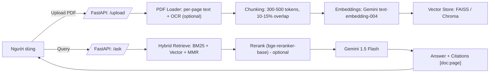

# 📚 RAG PDF QA — FastAPI + Gemini + FAISS

> Ứng dụng web RAG cho phép **tải PDF → hỏi đáp tiếng Việt** với **trích dẫn [doc:page]**, tối ưu cho đồ án/môn học.  
> Backend: **FastAPI**, Frontend: **Jinja2 + Bootstrap**, LLM/Embeddings: **Gemini API**, Vector store: **FAISS/Chroma**, OCR: **Tesseract**.

---

## ⭐ Tính năng nổi bật

- **Upload nhiều PDF** (≤ **5 tệp/lần**, mỗi tệp **≤ 10MB**), tự động lọc non-PDF.
- **Ingest**: trích text theo trang (pypdfium2 / pymupdf), **chunk token-aware (300–500, overlap 10–15%)**.
- **Embeddings**: **Gemini `text-embedding-004`** (mặc định), adapter dễ thay thế thành HF/OpenAI.
- **Vector Store**: **FAISS** (in-process) hoặc **Chroma** (persist), hỗ trợ **MMR**.
- **Hybrid Search**: **BM25 + Vector** (có thể bật/tắt, điều chỉnh **alpha**).
- **Reranker (tuỳ chọn)**: **bge-reranker-base** (CrossEncoder) để siết chính xác.
- **Generate**: **Gemini 1.5 Flash**, prompt RAG tiếng Việt, **bắt buộc chèn [doc:page]**.
- **Citations chi tiết**: (tên file + số trang + snippet) + **độ tin cậy**.
- **Cache**: cache embeddings theo hash chunk, cache câu trả lời theo (query + topIDs).
- **UI đẹp, gọn**: upload / ingest / hỏi đáp / xem citations, có **/healthz**.
- **Tests**: script đánh giá **accuracy** & **latency** theo testcases JSON.

---

## 🧠 Kiến trúc & Luồng xử lý



---

## 📂 Cấu trúc thư mục (tham chiếu)

```
rag-pdf/
│── app/
│   ├── main.py                 # Khởi tạo FastAPI, mount static/templates
│   ├── routes.py               # /, /upload, /ingest, /ask, /docs, /healthz
│   ├── rag/
│   │   ├── pdf_loader.py       # pypdfium2/pymupdf + OCR (tesseract, optional)
│   │   ├── chunking.py         # token-aware chunk (300–500, 10–15% overlap)
│   │   ├── embeddings.py       # Gemini embeddings + cache + thread pool
│   │   ├── vectorstore.py      # FAISS/Chroma wrapper (add/search/clear)
│   │   ├── hybrid.py           # BM25 + Vector, MMR, hợp nhất kết quả
│   │   ├── rerank.py           # bge-reranker-base (optional)
│   │   ├── generator.py        # Gemini 1.5 Flash + định dạng citations
│   │   └── answer_cache.py     # Cache câu trả lời theo query + docs
│   └── utils/
│       ├── config.py           # Đọc .env, validate, logs
│       ├── security.py         # Kiểm tra MIME/size/filename sanitize
│       ├── schema.py           # Pydantic models (requests/responses)
│       └── hash.py             # Hash nội dung chunk để cache embeddings
│
│── static/
│   ├── app.css                 # CSS giao diện
│   └── app.js                  # JS gọi API, render citations
│── templates/
│   └── index.html              # UI Jinja2 + Bootstrap
│
│── storage/                    # FAISS/Chroma + cache (persist)
│── uploads/                    # Thư mục phiên (./uploads/{session_id}/)
│
│── tests/
│   ├── eval_cases.json         # Test cases đơn giản (câu hỏi + từ khóa expected)
│   ├── simple_test.py          # Test nhanh toàn bộ flow (upload → ingest → ask)
│   └── run_eval.py             # Evaluation chi tiết với session có sẵn
│
│── .env                        # Cấu hình môi trường (bắt buộc)
│── .env.example                # Mẫu .env
│── requirements.txt            # Thư viện Python
│── README.md                   # Tài liệu này
```

---

## 🔧 Yêu cầu hệ thống

- Python **3.10 – 3.12** (Windows / Linux / macOS)
- Key từ **Google AI Studio** cho Gemini API
- (Tuỳ chọn) **Tesseract OCR** nếu cần đọc PDF scan ảnh
- (Tuỳ chọn) **PyTorch CPU** nếu bật **reranker**

---

## 📦 Cài đặt

### 1) Tạo môi trường ảo & cài thư viện

```powershell
# Windows PowerShell
python -m venv .venv
.\.venv\Scripts\Activate.ps1
pip install -r requirements.txt
```

> Nếu cài **faiss-cpu** bị lỗi trên Windows, có thể chuyển sang `VECTOR_STORE=chroma` trong `.env` để dùng **ChromaDB**.

### 2) Cấu hình `.env` (đầy đủ, theo dự án của bạn)

> Tạo file `.env` ở thư mục gốc. **Sửa `GEMINI_API_KEY` thành key thật**.

```ini
# --- Models ---
GEMINI_API_KEY=sk-your_real_gemini_key_here
RAG_EMBED_MODEL=text-embedding-004
RAG_LLM_MODEL=gemini-1.5-flash
EMBED_DIM=768

# --- Retrieval ---
HYBRID_ON=true
HYBRID_ALPHA=0.5          # ưu tiên BM25 hơn 1 chút để recall tốt câu keyword
RETRIEVE_TOP_K=12
CONTEXT_K=6
MMR_LAMBDA=0.5            # đa dạng ngữ cảnh

# --- Rerank (tùy chọn: bật khi nộp, tắt khi demo tiết kiệm) ---
RERANK_ON=true            # nếu cần siết chính xác; tắt để nhanh hơn & đỡ tải model

# --- Generation guardrail ---
GENERATE_MIN_SIM=0.20

# --- Storage/Cache ---
VECTOR_STORE=faiss
PERSIST_DIR=./storage
ENABLE_EMBED_CACHE=true
EMBED_CACHE_DIR=./storage/emb_cache
ENABLE_ANSWER_CACHE=true
ANSWER_CACHE_DB=./storage/answer_cache.sqlite

# --- Upload constraints ---
MAX_FILES=5
MAX_FILE_MB=10

# --- OCR (tùy chọn) ---
TESSERACT_CMD=C:\Program Files\Tesseract-OCR\tesseract.exe
OCR_LANG=vie
```

> **Gợi ý bảo mật**: Không commit `.env` lên Git. Để `GEMINI_API_KEY` trong secret khi CI/CD.

### 3) Cài đặt OCR (nếu dùng PDF scan)

- **Windows**: cài [Tesseract OCR](https://sourceforge.net/projects/tesseract-ocr.mirror/files/5.5.0/tesseract-ocr-w64-setup-5.5.0.20241111.exe/download). Mặc định:  
  `C:\Program Files\Tesseract-OCR\tesseract.exe` → khớp với `TESSERACT_CMD` trong `.env`  
- **Linux/macOS**: dùng `sudo apt-get install tesseract-ocr` hoặc `brew install tesseract`.

> Nếu **không dùng OCR**: bỏ tick “Sử dụng OCR” trong UI để tránh log cảnh báo.

### 4) (Tuỳ chọn) Cài Reranker (bge-reranker-base)

```powershell
pip install sentence-transformers rapidfuzz
# Torch CPU (Windows/Linux/macOS)
pip install torch --index-url https://download.pytorch.org/whl/cpu
```

> Reranker tăng độ chính xác nhưng **tăng latency**. Bật bằng `RERANK_ON=true`.

---

## ▶️ Chạy ứng dụng

```powershell
uvicorn app.main:app --reload
```

- Mặc định tại `http://127.0.0.1:8000`
- Health check: `GET /healthz` → `{"status": "ok"}`

**Quy trình UI**:
1. **Upload** PDF (1–5 tệp).
2. **Ingest**: bật OCR nếu là PDF scan.
3. **Hỏi** tiếng Việt → Nhận câu trả lời + **citations** + **confidence**.

---

## 🔌 API Endpoints

- `GET /` → Trang chủ
- `POST /upload` → Nhận tệp PDF. **Form field**: `files` (multi-part).  
  **Response**: `{ "session_id": "uuid", "files": [{"path": "./uploads/<session>/a.pdf","name":"a.pdf"}] }`
- `POST /ingest` → Trích, chunk, embed, upsert. **Form fields**:  
  - `session_id`: chuỗi UUID  
  - `ocr`: `true|false` (tuỳ chọn)  
  **Response**: `{"ingested":[{"doc":"a.pdf","pages":10,"chunks":35}], "total_chunks": 35, "latency_ms": 9123 }`
- `POST /ask` → Truy vấn RAG. **Form fields**:  
  - `query`: câu hỏi tiếng Việt  
  - (optional) `selected_docs`: danh sách tên file để filter  
  **Response**:
  ```json
  {
    "answer": "… [a.pdf:3] …",
    "confidence": 0.91,
    "citations": [
      {"doc":"a.pdf","page":3,"score":0.83,"text_span":"..."}
    ],
    "latency_ms": 1234
  }
  ```
- `GET /docs` hoặc `/rag-docs` → Liệt kê tài liệu đã ingest.
- `GET /healthz` → `{"status": "ok"}`

---

## 🧪 Kiểm thử (Eval)

### 1) Test đơn giản và nhanh
```powershell
python tests\simple_test.py
```

### 2) Evaluation chi tiết
```powershell
# Với session có sẵn
$env:TEST_SESSION_ID="test-session-abc123"; python tests\run_eval.py

# Hoặc tạo session mới
python tests\run_eval.py
```

**Output mẫu**:
```
=== RAG PDF Simple Test ===
✅ Server đang chạy
✅ Upload thành công  
✅ Ingest thành công: 4 chunks
Accuracy: 100.0% (3/3)
🎉 TEST PASS!
```

> Test cases được định nghĩa trong `tests/eval_cases.json` với format đơn giản:
```json
[
  {
    "q": "Câu hỏi A?", 
    "expected": ["từ khóa 1", "từ khóa 2"]
  }
]
```

---

## 🎯 Kinh nghiệm tăng **Độ chính xác** & **Tốc độ** (và **tiết kiệm quota**)

- **Chunk** 350–450 tokens, overlap **10–12%** → cân bằng recall/latency.
- **Top-K**: `RETRIEVE_TOP_K=12`, `CONTEXT_K=6`, `MMR_LAMBDA=0.5` → đa dạng ngữ cảnh tốt.
- **Hybrid**: bật `HYBRID_ON=true`, `HYBRID_ALPHA=0.5` → keyword + semantic.
- **Reranker**: bật khi nộp báo cáo; tắt khi demo (tiết kiệm thời gian & tải model).
- **Cache**: bật `ENABLE_EMBED_CACHE=true` (hash chunk), `ENABLE_ANSWER_CACHE=true`  
  → tiết kiệm **Gọi Gemini** khi ingest lại/tái hỏi cùng dữ liệu.
- **Guardrail**: `GENERATE_MIN_SIM=0.20` → tránh “bịa”, chỉ trả lời khi nguồn **đủ liên quan**.
- **Chọn `FAISS`** khi 1 tiến trình; cần multi-process → cân nhắc `Chroma` hoặc `pgvector`.

---

### 1) `API key not valid…` (400)
- Kiểm tra `.env` có `GEMINI_API_KEY=sk-...` **đúng**.
- **Để kiểm tra key**, chạy lệnh sau trong PowerShell (thay `sk-...` bằng key của bạn):
  ```powershell
  # Gán API key vào biến môi trường tạm thời
  $env:GEMINI_API_KEY = "sk-..."
  
  # Chạy script Python ngắn để gọi API
  @"
  import google.generativeai as genai, os, sys
  try:
      genai.configure(api_key=os.getenv("GEMINI_API_KEY"))
      e = genai.embed_content(model="text-embedding-004", content="ping", task_type="retrieval_document")
      print(f"API Key hợp lệ. Dimension: {len(e['embedding'])}")
  except Exception as e:
      print(f"Lỗi: {e}", file=sys.stderr)
  "@ | python -
  ```
- **Quan trọng**: Restart server sau khi đổi `.env` để server nhận key mới.
  ```powershell
  # Dừng tất cả các tiến trình python đang chạy (để dừng server cũ)
  Stop-Process -Name python -ErrorAction SilentlyContinue
  
  # Khởi động lại server
  uvicorn app.main:app --reload
  ```


### 2) `tesseract is not installed or it's not in your PATH`
- Cài Tesseract & chỉnh `TESSERACT_CMD` đúng đường dẫn.  
- Nếu **không cần OCR**: bỏ tick OCR trong UI.

### 3) FAISS không cài được
- Đổi `.env`: `VECTOR_STORE=chroma` và cài `chromadb` trong `requirements.txt`.

### 4) PyTorch nặng/không muốn tải
- Đặt `RERANK_ON=false` để tắt reranker.

### 5) `/ask` báo `Vector store chưa khởi tạo`
- Phải **/ingest** trước khi gọi **/ask** (hoặc khởi tạo store với `get_store(dim)` sau embed).

---

## 📘 requirements.txt (gợi ý đầy đủ)

> Bạn có thể tinh giản nếu không dùng một số tuỳ chọn.

```txt
fastapi
uvicorn[standard]
jinja2
python-multipart
python-dotenv
pydantic

numpy
scikit-learn
scipy
rank-bm25
rapidfuzz

pypdfium2
pymupdf
pytesseract

faiss-cpu
chromadb

google-generativeai
huggingface_hub
transformers

sentence-transformers
```
> Nếu bật reranker: cần `torch` (cài riêng theo CPU/GPU).  
> Nếu chỉ chọn **FAISS** thì có thể bỏ `chromadb`. Nếu chỉ chọn **Chroma** thì có thể bỏ `faiss-cpu`.

---

## 🔐 An toàn & riêng tư

- Chỉ cho phép MIME `application/pdf`, kiểm tra **size** & **số lượng** file theo `.env`.
- Sanitize tên file, tách thư mục theo **session_id**.
- Không ghi log **nội dung nhạy cảm**, chỉ log số chunk, thời gian, điểm top-k.
- Trả lời tuân thủ prompt hệ thống: **chỉ dựa trên tài liệu**, nếu thiếu → `"Không thấy thông tin..."`.

---

## 🧭 Lộ trình mở rộng

- **pgvector / Qdrant** để chạy đa tiến trình/đa node.
- Bộ nhớ hội thoại (multi-turn) + “map-reduce” context.
- Fine-tune reranker nhẹ, riêng bộ tài liệu môn học.
- Giao diện SPA (React/Next.js) + export PDF/CSV câu trả lời.

---

## 👤 Tác giả & Thông tin môn học

- Sinh viên: **Lê Đình Dũng**
- Mã sinh viên: **211240089**
- Môn học: **Chuyên đề CNTT – Bài tập lớn**
- Năm học: **2025**
- GV hướng dẫn: **Thầy Bùi Ngọc Dũng**

---

## 📄 Giấy phép

Project phục vụ mục đích học tập & nghiên cứu. Vui lòng tham khảo quy định của trường về trích dẫn & sử dụng nguồn dữ liệu.

---

### 💬 Góp ý
Nếu bạn muốn mình bổ sung screenshot giao diện, template báo cáo, hoặc script deploy (Docker/Render/VPS), cứ nhắn mình nhé!
